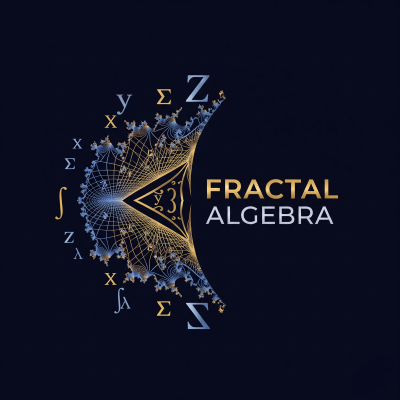

<p align="center">
  
</p>    
</div>

# Fractal Algebra

The overarching goal of this project is to develop tools and theories based on a "fractal" understanding of mathematical and physical systems. We explore the idea that complexity arises from simple, iterative rules, and that the relationships between objects are as important as the objects themselves.

The project investigates concepts such as:
- The geometric patterns hidden in the prime factorizations of integers.
- The potential for a unified "fractal algebra" to describe phenomena across different scales.
- The nature of time and observation in a universe with fractal structure.

## Status
The project is essentially complete in it's present state, what remains todo is create a suite of examples to highlight it's utility, these are in the works and should be available around December 2025.


[](https://crates.io/crates/fractal_algebra)
[](https://docs.rs/fractal_algebra)
[](https://opensource.org/licenses/MIT)
[](https://github.com/Neil-Crago/fractal_algebra/actions/workflows/rust.yml)

 ## FractalGraph

- A custom data structure designed as a hybrid of a graph, a trie, and a spatial index.
- It moves beyond simple visualization to create a rich, explorable network of relationships between numbers based on their prime factorizations.
- Nodes in the graph represent `n!`, and relationships (edges) are formed dynamically based on mathematical similarity and shared number-theoretic traits.
- Traversal of the graph mimics fractal expansion: recursive, self-similar, and semantically rich.

## Resonance Algebra

This is a trait-based algebraic extension for composing, transforming, and evaluating mathematical objects based on resonance. It encodes semantic meaning directly into traits, operations, and laws—bridging mathematical abstraction with computational clarity.

#### This includes:

- Resonance trait for scoring, comparing, and classifying fractal objects
- ResonanceLaw enum for semantic behavior (e.g. Harmony, Echo, Dissonance)
- ResonantTransform trait for resonance-aware evolution
- CompositeTransform for chaining transformations
- FractalCollection and ResonantFractalCollection for algebraic composition
- ResonanceFilter for semantic selection and pruning
- ResonanceRuleEngine for enforcing algebraic laws

### 🧪 Example Usage (for Resonance)

```rust
let a = FractalEdge::new(...); // Harmony, score 0.8
let b = FractalEdge::new(...); // Harmony, score 0.9

let union = a.add(&b); // Allowed by ResonanceRuleEngine

let filter = LawFilter {
    allowed: vec![ResonanceLaw::Harmony],
};

let filtered = resonant_collection.filter(&filter);
```

## A Fractal Quantum Space

A Semantic Manifold of Infinite Resonance

FractalQuantumSpace is not a simulation of quantum mechanics. It is a semantic engine that encodes the fractal nature of reality—where each quantum event is a recursive transformation, and each dimension is a resonance axis.

### Why Infinite Dimensions?

In classical physics, dimensions are fixed. In quantum mechanics, they’re functional. But in a fractal ontology, dimensions are emergent—each transformation reveals new structure. There is no upper bound.

### Core Concepts

- SemanticUnit: The atomic unit of meaning—could be a wavefunction, a law fragment, or a resonance node.
- ResonanceDepth: How deep the space has unfolded through recursive transformation.
- Projection: Observation is modeled as projection onto a finite slice of the infinite manifold.
- Transformation: Applying a rule deepens the structure, revealing new semantic layers.
- Filtering: Selects meaningful subsets based on resonance criteria.
- FractalSignature: A symbolic fingerprint of the current state—useful for comparison, visualization, or law enforcement.

### Use Cases

- Modeling recursive quantum systems
- Encoding semantic laws as transformations
- Visualizing resonance depth and structure
- Building epistemic engines that evolve meaningfully

---

## Related Projects within the workspace

### 1. `factorial_engine`

A high-performance, zero-error crate for computing the prime factorization of factorials (`n!`). It uses **Legendre's Formula** to calculate results directly and efficiently, serving as a robust computational backend for number-theoretic analysis.

### 2. `tma_engine`

A lightweight crate providing the algebraic tools for 2D affine transformations (`TMA`). This engine is the geometric heart of the project, used for generating fractals via Iterated Function Systems (IFS) and the Chaos Game algorithm.

## License

MIT or Apache License © Neil Crago  
This project is open-source and designed for philosophical and mathematical exploration.

---

## A Final Note

> “This is not just a framework. It is a way of thinking.”

## Related Crates
This crate is part of a collection of crates by the same author:
These include:-
  * MOMA
  * MOMA_simulation_engine
  * tma_engine
  * factorial_engine
  * fa_slow_ai
  * Coheron
