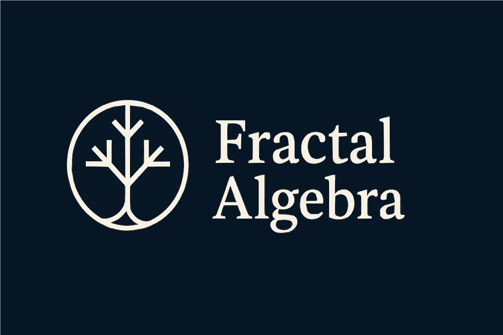

<p align="center">
  
</p>  

# Fractal Algebra Workspace

**A research workspace for exploring the deep connections between number theory, algebra, and geometry.**

This project is a journey into the structures that emerge from simple mathematical rules. It began as an engine for generating classic fractals and has evolved into a dual-purpose workspace for both practical computation and theoretical exploration.

## Core Projects

This workspace is structured as a Rust workspace containing several distinct but related crates:

### 1. `factorial_engine`

A high-performance, zero-error crate for computing the prime factorization of factorials (`n!`). It uses **Legendre's Formula** to calculate results directly and efficiently, serving as a robust computational backend for number-theoretic analysis.

### 2. `tma_engine`

A lightweight crate providing the algebraic tools for 2D affine transformations (`TMA`). This engine is the geometric heart of the project, used for generating fractals via Iterated Function Systems (IFS) and the Chaos Game algorithm.

### 3. `fractal_algebra` (The Main Application)

This is the primary research and application crate where the computational and geometric engines are brought together. It focuses on discovering and analyzing the emergent structures from number-theoretic data.

The key innovation in this crate is the **`FractalGraph`**:

- A custom data structure designed as a hybrid of a graph, a trie, and a spatial index.
- It moves beyond simple visualization to create a rich, explorable network of relationships between numbers based on their prime factorizations.
- Nodes in the graph represent `n!`, and relationships (edges) are formed dynamically based on mathematical similarity and shared number-theoretic traits.
- Traversal of the graph mimics fractal expansion: recursive, self-similar, and semantically rich.

## Vision

The overarching goal of this workspace is to develop tools and theories based on a "fractal" understanding of mathematical and physical systems. We explore the idea that complexity arises from simple, iterative rules, and that the relationships between objects are as important as the objects themselves.

The project investigates concepts such as:
- The geometric patterns hidden in the prime factorizations of integers.
- The potential for a unified "fractal algebra" to describe phenomena across different scales.
- The nature of time and observation in a universe with fractal structure.

## Getting Started

To explore this workspace, clone the repository and build it using Cargo:
```bash
git clone https://github.com/neil-crago/fractal_algebra.git
cd fractal_algebra
cargo build --release
```